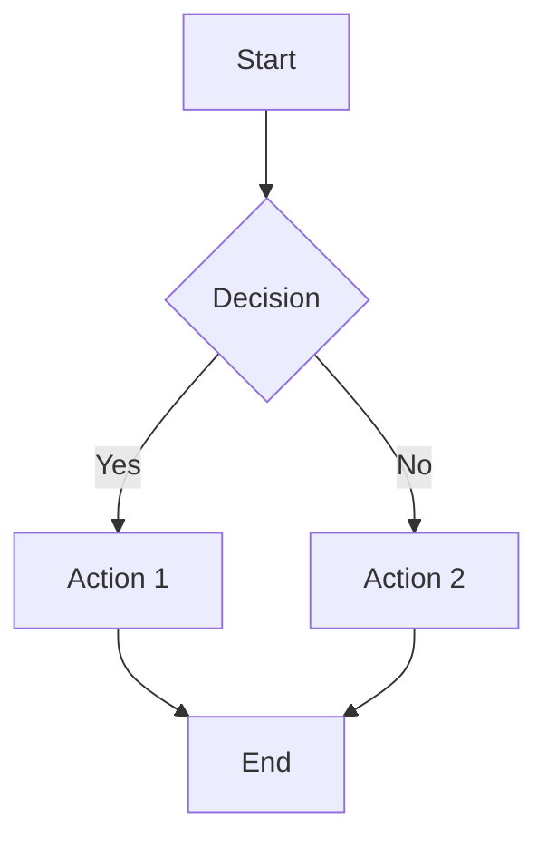
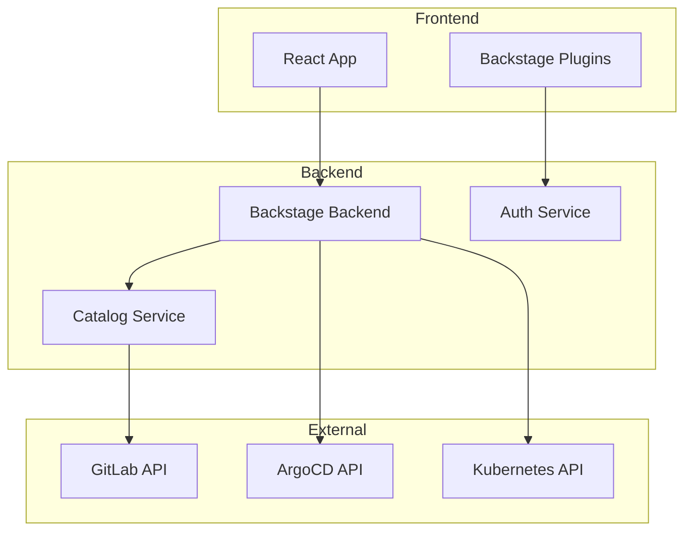
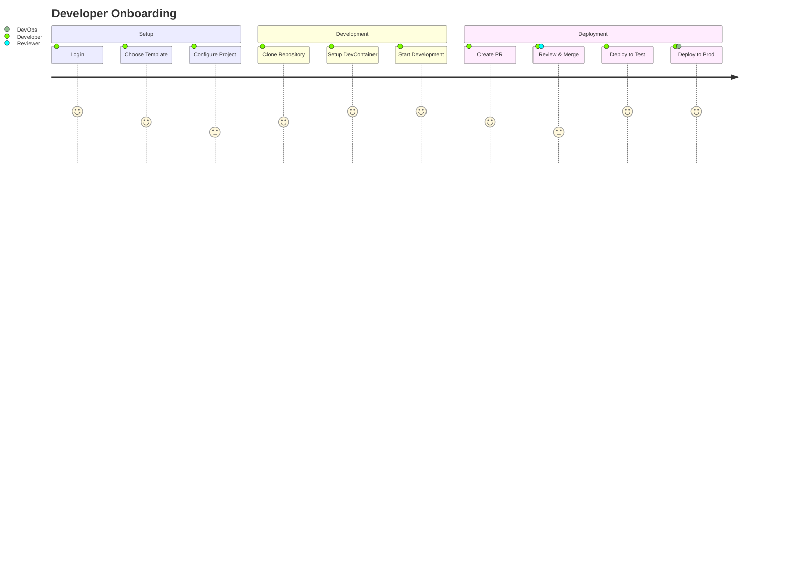
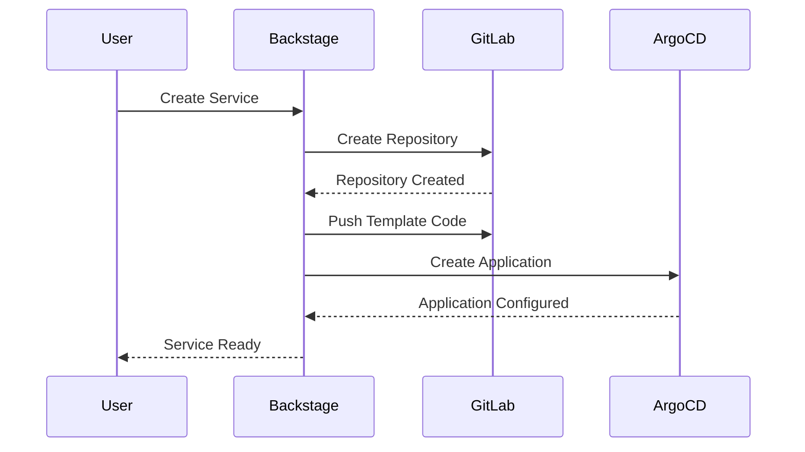
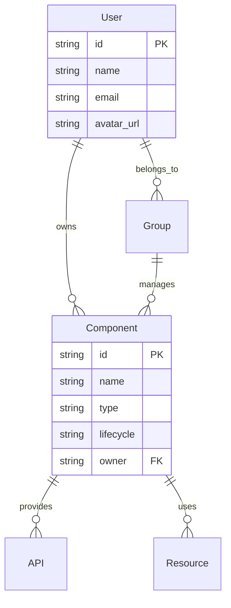
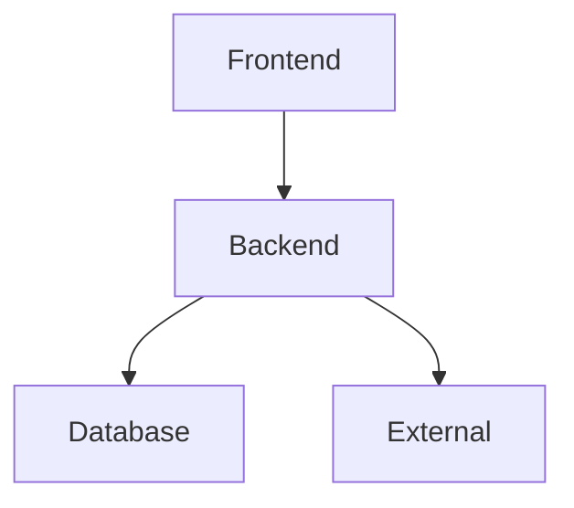

# Development Best Practices

## Context

Global development guidelines for Agent OS projects.

<conditional-block context-check="core-principles">
IF this Core Principles section already read in current context:
  SKIP: Re-reading this section
  NOTE: "Using Core Principles already in context"
ELSE:
  READ: The following principles

## Core Principles

### Keep It Simple

- Implement code in the fewest lines possible
- Avoid over-engineering solutions
- Choose straightforward approaches over clever ones

### Optimize for Readability

- Prioritize code clarity over micro-optimizations
- Write self-documenting code with clear variable names
- Add comments for "why" not "what"

### DRY (Don't Repeat Yourself)

- Extract repeated business logic to private methods
- Extract repeated UI markup to reusable components
- Create utility functions for common operations

### File Structure

- Keep files focused on a single responsibility
- Group related functionality together
- Use consistent naming conventions
</conditional-block>

<conditional-block context-check="dependencies" task-condition="choosing-external-library">
IF current task involves choosing an external library:
  IF Dependencies section already read in current context:
    SKIP: Re-reading this section
    NOTE: "Using Dependencies guidelines already in context"
  ELSE:
    READ: The following guidelines
ELSE:
  SKIP: Dependencies section not relevant to current task

## Dependencies

### Choose Libraries Wisely

When adding third-party dependencies:

- Select the most popular and actively maintained option
- Check the library's GitHub repository for:
  - Recent commits (within last 6 months)
  - Active issue resolution
  - Number of stars/downloads
  - Clear documentation
</conditional-block>

<conditional-block context-check="development-environment" task-condition="setting-up-development">
IF current task involves setting up or configuring development environment:
  IF Development Environment section already read in current context:
    SKIP: Re-reading this section
    NOTE: "Using Development Environment guidelines already in context"
  ELSE:
    READ: The following guidelines
ELSE:
  SKIP: Development Environment section not relevant to current task

## Development Environment

### Use DevContainers for Development

All development should be performed using DevContainers to ensure:

- **Consistent Environment**: Same development environment across all team members
- **Dependency Management**: All tools, runtime versions, and dependencies pre-configured
- **Quick Onboarding**: New developers can start contributing immediately
- **CI/CD Parity**: Development environment matches production deployment containers

#### DevContainer Implementation

- Use `.devcontainer/devcontainer.json` for configuration
- Include all necessary development tools and extensions
- Configure Docker Compose for multi-service dependencies (databases, caches, etc.)
- Pre-install required Node.js versions, package managers, and CLI tools
- Set up proper port forwarding for services and debugging

#### Benefits for Backstage Development

- PostgreSQL database automatically configured and ready
- Yarn workspaces and Backstage CLI pre-installed
- Consistent Node.js version (20 || 22) across environments
- Pre-configured extensions for TypeScript, React, and Backstage development
- Automatic environment variable setup from `.env` files

#### Best Practices

- Always use `mcp-devcontainers` tools for running commands in containers
- Append `--no-watch --verbose` to yarn/npm commands for better CI output
- Keep devcontainer configuration in version control
- Document any manual setup steps in `.devcontainer/README.md`
- Test devcontainer setup on fresh machines regularly

#### DevContainer Command Execution and Troubleshooting

When executing commands in DevContainers, always use output log paths for debugging and problem resolution:

##### Standard Command Pattern

```bash
# Always specify an output log file path
mcp-devcontainers_devcontainer_exec \
  --workspaceFolder="/path/to/project" \
  --outputFilePath="/tmp/command-output.log" \
  --command=["yarn", "install", "--verbose"]
```

##### Troubleshooting Workflow

1. **Execute with Logging**: Always capture command output to a log file
2. **Check Exit Status**: Verify command completion status
3. **Analyze Logs**: Read output logs to identify specific errors or warnings
4. **Pattern Recognition**: Look for common failure patterns in logs
5. **Iterative Debugging**: Use log insights to adjust commands and retry

##### Common Log Analysis Patterns

**Dependency Installation Issues**:

```bash
# Check for network issues, package conflicts, or version mismatches
grep -i "error\|fail\|timeout\|conflict" /tmp/yarn-install.log
```

**Build Failures**:

```bash
# Look for TypeScript errors, missing dependencies, or configuration issues
grep -i "error TS\|cannot find module\|failed to compile" /tmp/build.log
```

**Database Connection Problems**:

```bash
# Check for connection timeouts, authentication failures, or schema issues
grep -i "connection\|timeout\|auth\|schema" /tmp/database.log
```

##### Example Troubleshooting Session

```bash
# 1. Execute command with logging
mcp-devcontainers_devcontainer_exec \
  --workspaceFolder="/workspace" \
  --outputFilePath="/tmp/backstage-build.log" \
  --command=["yarn", "build:backend", "--verbose"]

# 2. Check if command succeeded
if [ $? -ne 0 ]; then
  echo "Build failed, analyzing logs..."

  # 3. Analyze specific error patterns
  echo "TypeScript errors:"
  grep "error TS" /tmp/backstage-build.log

  echo "Missing dependencies:"
  grep "Cannot resolve dependency" /tmp/backstage-build.log

  echo "Configuration issues:"
  grep -i "config.*error\|invalid.*config" /tmp/backstage-build.log
fi

# 4. Take corrective action based on log analysis
# Example: If missing dependency found, install it
if grep -q "Cannot resolve dependency" /tmp/backstage-build.log; then
  echo "Installing missing dependencies..."
  mcp-devcontainers_devcontainer_exec \
    --workspaceFolder="/workspace" \
    --outputFilePath="/tmp/dependency-install.log" \
    --command=["yarn", "install", "--check-files"]
fi
```

##### Log File Management Best Practices

- **Descriptive Names**: Use meaningful log file names that indicate the operation
- **Timestamp Integration**: Include timestamps in log file names for tracking
- **Log Rotation**: Clean up old log files to prevent disk space issues
- **Structured Logging**: Use consistent log file locations for easy access

##### Common DevContainer Issues and Solutions

**Container Startup Problems**:

```bash
# Log container initialization
mcp-devcontainers_devcontainer_up \
  --workspaceFolder="/workspace" \
  --outputFilePath="/tmp/container-startup.log"

# Check for common issues
grep -i "port.*conflict\|volume.*error\|permission.*denied" /tmp/container-startup.log
```

**Environment Configuration Issues**:

```bash
# Verify environment setup
mcp-devcontainers_devcontainer_exec \
  --workspaceFolder="/workspace" \
  --outputFilePath="/tmp/env-check.log" \
  --command=["env"]

# Check for missing environment variables
grep -i "undefined\|not.*set\|missing" /tmp/env-check.log
```

**Service Dependencies**:

```bash
# Test database connectivity
mcp-devcontainers_devcontainer_exec \
  --workspaceFolder="/workspace" \
  --outputFilePath="/tmp/db-test.log" \
  --command=["yarn", "backstage-cli", "migrate:status"]

# Analyze database connection issues
grep -i "connection.*refused\|timeout\|authentication" /tmp/db-test.log
```

This systematic approach ensures that all DevContainer operations are logged and issues can be quickly identified and resolved through log analysis.

#### DevContainer Testing Best Practices

Based on comprehensive unit testing experience with Backstage plugins, these practices ensure reliable test execution in DevContainer environments:

##### Test Environment Setup

```bash
# Validate test environment before running tests
mcp-devcontainers_devcontainer_exec \
  --workspaceFolder="/workspace" \
  --outputFilePath="/tmp/test-env-check.log" \
  --command=["node", "--version"]

# Verify TypeScript compilation
mcp-devcontainers_devcontainer_exec \
  --workspaceFolder="/workspace" \
  --outputFilePath="/tmp/tsc-check.log" \
  --command=["npx", "tsc", "--noEmit"]
```

##### Test Execution Patterns

**Individual Test Files**:
```bash
# Run specific test file with comprehensive logging
mcp-devcontainers_devcontainer_exec \
  --workspaceFolder="/workspace/plugins/your-plugin" \
  --outputFilePath="/tmp/test-individual.log" \
  --command=["npx", "jest", "src/__tests__/your-test.test.ts", "--verbose", "--no-cache", "--forceExit"]
```

**Test Suite Validation**:
```bash
# Run comprehensive test suite
mcp-devcontainers_devcontainer_exec \
  --workspaceFolder="/workspace" \
  --outputFilePath="/tmp/test-suite.log" \
  --command=["yarn", "workspace", "@internal/your-plugin", "test", "--", "--verbose", "--passWithNoTests"]
```

##### Test Output Analysis

**Jest Configuration Issues**:
```bash
# Check Jest configuration and test discovery
grep -i "no tests found\|test pattern\|config.*error" /tmp/test-execution.log
```

**TypeScript Compilation in Tests**:
```bash
# Identify TypeScript errors preventing test execution
grep -i "error TS\|cannot find module\|type.*error" /tmp/test-compilation.log
```

**Service Integration Problems**:
```bash
# Check for service initialization failures in tests
grep -i "service.*error\|initialization.*failed\|dependency.*missing" /tmp/test-service.log
```

##### Testing Framework Integration

**Backstage Plugin Testing**:
```bash
# Validate Backstage plugin test setup
mcp-devcontainers_devcontainer_exec \
  --workspaceFolder="/workspace/plugins/logistics-observer-backend" \
  --outputFilePath="/tmp/backstage-plugin-test.log" \
  --command=["npx", "jest", "--listTests"]
```

**Database Testing with TestDatabases**:
```bash
# Test database integration with proper cleanup
mcp-devcontainers_devcontainer_exec \
  --workspaceFolder="/workspace/plugins/your-plugin" \
  --outputFilePath="/tmp/database-test.log" \
  --command=["npx", "jest", "src/database/__tests__", "--runInBand", "--detectOpenHandles"]
```

##### Common Testing Issues and Solutions

**Test Discovery Problems**:
- **Issue**: Jest reports "No tests found"
- **Solution**: Verify test file naming patterns (*.test.ts) and Jest configuration
- **Command**: Check with `npx jest --listTests` to see discovered tests

**Memory and Resource Issues**:
- **Issue**: Tests timeout or fail due to resource constraints
- **Solution**: Use `--runInBand` for sequential execution and `--detectOpenHandles` for cleanup
- **Monitoring**: Add timeout commands (`timeout 60s`) for long-running tests

**Service Mocking Challenges**:
- **Issue**: Backstage service mocking compatibility
- **Solution**: Use proper `mockServices` from `@backstage/backend-test-utils`
- **Validation**: Create simple working tests before complex integration tests

##### Test Automation Scripts

Create comprehensive test validation scripts within DevContainers:

```bash
#!/bin/bash
# comprehensive-test-runner.sh

echo "=== DevContainer Test Execution ==="
echo "Date: $(date)"

# Test files to validate
TEST_FILES=(
    "src/__tests__/basic.test.ts"
    "src/__tests__/plugin-working.test.ts"
    "src/database/__tests__/DatabaseService.simple.test.ts"
)

PASSED=0
FAILED=0

for test_file in "${TEST_FILES[@]}"; do
    echo "📋 Testing: $test_file"
    if timeout 45s npx jest "$test_file" --verbose --no-cache --forceExit >/dev/null 2>&1; then
        echo "✅ PASSED: $test_file"
        ((PASSED++))
    else
        echo "❌ FAILED: $test_file"
        ((FAILED++))
    fi
done

echo "Results: $PASSED passed, $FAILED failed"
```

##### DevContainer Test Performance

**Optimization Strategies**:
- Use `--no-cache` to prevent Jest cache issues
- Add `--forceExit` to prevent hanging processes
- Use `--runInBand` for database tests to avoid conflicts
- Set appropriate timeouts for long-running operations

**Resource Management**:
- Monitor memory usage during test execution
- Clean up test databases between runs
- Use proper service cleanup in test teardown

##### Integration with CI/CD

**DevContainer in CI**:
```yaml
# Example GitHub Actions integration
steps:
  - name: Run tests in DevContainer
    run: |
      devcontainer exec --workspace-folder . \
        npm test -- --coverage --verbose
```

**Test Result Validation**:
- Ensure exit codes are properly captured
- Log test output for debugging
- Generate coverage reports within container
- Preserve test artifacts for analysis

This comprehensive testing approach within DevContainers ensures reliable, reproducible test execution across all development environments.

## Backstage-Specific Best Practices

### Plugin Creation Workflow

- When creating a new Backstage plugin using `yarn new`, always stop and ask the user to manually run the command.
- The plugin scaffolding process is interactive and cannot be fully automated.
- Wait for user feedback before continuing with any automation or code generation related to the new plugin.
</conditional-block>

<conditional-block context-check="documentation-diagrams" task-condition="creating-documentation">
IF current task involves creating documentation with diagrams or visual explanations:
  IF Documentation Diagrams section already read in current context:
    SKIP: Re-reading this section
    NOTE: "Using Documentation Diagrams guidelines already in context"
  ELSE:
    READ: The following guidelines
ELSE:
  SKIP: Documentation Diagrams section not relevant to current task

## Documentation Diagrams

### Use Mermaid for Visual Documentation

All diagrams and visual documentation should use Mermaid syntax for:

- **Version Control**: Diagrams are code and can be diffed/reviewed
- **Consistency**: Standardized appearance across all documentation
- **Maintainability**: Easy to update without external tools
- **Integration**: Native support in Backstage TechDocs and GitHub/GitLab

#### Supported Diagram Types

- **Flowcharts**: Process flows, decision trees, workflows
- **Sequence Diagrams**: API interactions, service communications
- **Class Diagrams**: Data models, component relationships
- **Entity Relationship Diagrams**: Database schemas, data relationships
- **State Diagrams**: Component states, workflow states
- **Gitgraph**: Git branching strategies, release flows
- **User Journey**: User experience flows, onboarding processes

#### Backstage Integration

Backstage supports Mermaid through the TechDocs addon:

- Install `backstage-plugin-techdocs-addon-mermaid`
- Diagrams render automatically in documentation
- Supports all Mermaid diagram types
- Maintains consistent styling with Backstage theme

#### Best Practices

##### Diagram Complexity

- Keep diagrams simple and focused on one concept
- Break complex flows into multiple smaller diagrams
- Use consistent naming conventions for nodes and entities
- Limit diagrams to 10-15 nodes for readability

##### Code Structure

````markdown

````

##### Styling Guidelines
- Use consistent node shapes for similar concepts
- Apply semantic colors (red for errors, green for success)
- Keep text labels concise (2-4 words)
- Use meaningful IDs for nodes (not just A, B, C)

#### Common Diagram Patterns

##### Service Architecture
````markdown

````

##### User Flow
````markdown

````

##### API Sequence
````markdown

````

##### Database Schema
````markdown

````

#### Documentation Integration

##### File Organization
- Place diagrams inline with related text
- Use descriptive titles and captions
- Include brief explanations before complex diagrams
- Reference diagrams from multiple sections when relevant

##### Example Documentation Structure
````markdown
# Service Architecture

Our platform uses a microservices architecture with clear separation of concerns.

## Overview



The architecture consists of three main layers:

### Frontend Layer

- React-based user interface
- Backstage plugin system
- [Additional details...]

### Backend Layer

[Detailed explanation with sequence diagram...]

### Integration Layer

[External service integration with flowchart...]

````

#### Mermaid Syntax Quick Reference

- **Flowchart**: `graph TD` (top-down) or `graph LR` (left-right)
- **Sequence**: `sequenceDiagram`
- **Class**: `classDiagram`
- **State**: `stateDiagram-v2`
- **ER**: `erDiagram`
- **Journey**: `journey`
- **Gitgraph**: `gitGraph`

#### Troubleshooting
- Validate syntax using Mermaid Live Editor
- Check for proper indentation and spacing
- Ensure node IDs are unique within diagrams
- Test rendering in Backstage TechDocs environment
- Use browser developer tools to debug rendering issues
</conditional-block>
